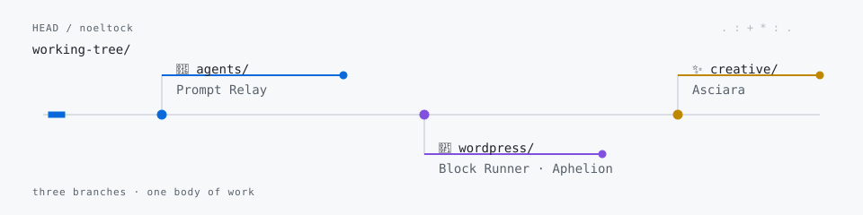

# Noel Tock

I build tools for WordPress and for working with AI.

Chief Growth Officer at Human Made. [AI field notes](https://noeltock.com/ai) · [LinkedIn](https://www.linkedin.com/in/noeltock/)

<picture>
  <source media="(prefers-color-scheme: dark) and (max-width: 640px)" srcset="assets/working-tree-mobile-dark.svg">
  <source media="(max-width: 640px)" srcset="assets/working-tree-mobile-light.svg">
  <source media="(prefers-color-scheme: dark)" srcset="assets/working-tree-dark.svg">
  
</picture>

`agents/` — [Prompt Relay](https://github.com/noeltock/prompt-relay): a plain-Markdown routing template mapping lead, coding, advisor, QA, and runner roles to suitable models for Claude Code and Codex, with verification and evals.

`wordpress/` — [Block Runner](https://github.com/humanmade/block-runner): converts generated HTML into nested native Gutenberg blocks and validates output against headless Gutenberg. [Official page](https://www.accelerateplugin.com/block-runner/).

`creative/` — [Asciara](https://github.com/noeltock/asciara): turns images into structured ASCII assets, calm animated media, and self-contained web heroes using luminance and edge-aware glyph rendering.

## Wider tree

`work/` 
├── `agents/` — [Codex Review](https://github.com/noeltock/codex-review): routing code review to Codex from Claude. 
├── `wordpress/` — [Aphelion](https://github.com/humanmade/aphelion): a local flight recorder for AI agents working on WordPress; [Wesper](https://github.com/humanmade/wesper): read-only WordPress context manifests; [Accelerate AI Toolkit](https://github.com/humanmade/accelerate-ai-toolkit): insights, experimentation, and personalization for WordPress. 
└── `field-notes/` — [The 5 Levels of Agentic WordPress](https://www.accelerateplugin.com/blog/the-5-levels-of-agentic-wordpress/): article.

Earlier work

[tiltShift.js](https://github.com/noeltock/tiltShift.js) is a jQuery plugin using CSS3 filters to replicate the tilt-shift effect.

